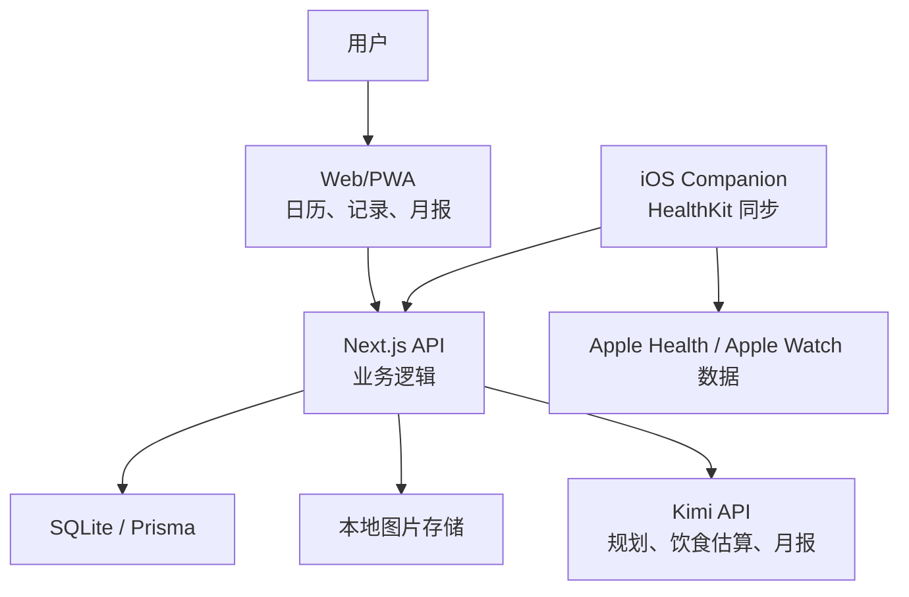

# CalenZoey 技术设计

## 1. 总体结论

本机服务器可行，而且适合作为第一阶段。推荐先做一个 local-first Web/PWA：

- 电脑端：本机运行服务，浏览器访问。
- 手机端：同一局域网访问电脑 IP，或后续通过 Tailscale/Cloudflare Tunnel/正式部署访问。
- 数据：默认存在本机 SQLite，后续可迁移到 PostgreSQL。
- LLM：服务端接入 Kimi API，API Key 只放服务端环境变量。
- Apple Watch/健康数据：纯网页无法直接读取 Apple Health。需要后续做 iOS App 或 iOS Companion，通过 HealthKit 授权读取后同步到服务端。

## 2. 推荐技术栈

### 2.1 MVP 技术栈

- 前端与服务端：Next.js + TypeScript。
- UI：React + CSS Modules 或 Tailwind CSS。
- 日历交互：FullCalendar 或自研轻量周历组件。
- 数据库：SQLite。
- ORM：Prisma。
- 文件存储：本地 `uploads/` 目录。
- LLM SDK：OpenAI Node SDK 或 Kimi 官方兼容 SDK，按官方文档配置 Kimi API 的 `baseURL` 和模型名。
- 部署：本机 `pnpm dev` 或 `pnpm start`。

选择理由：

- Next.js 可以同时做 UI 和 API routes，MVP 简洁。
- SQLite 适合单人 local-first 使用。
- Prisma 方便后续迁移数据库。
- Kimi API 兼容 OpenAI API 格式，接入成本低。

### 2.2 后续移动端路线

两条路线：

- 路线 A：PWA 优先。手机 Safari 添加到主屏幕，快速记录、查看今日计划、上传饮食照片。
- 路线 B：SwiftUI iOS Companion。专门负责 HealthKit 授权、读取 Apple Health 数据、同步运动和能量消耗。

推荐顺序：先 PWA，再 SwiftUI Companion。这样先验证生活规划体验，再解决健康数据自动同步。

## 3. 系统架构



## 4. 模块设计

### 4.1 Calendar 模块

职责：

- 周视图和日视图。
- 创建、编辑、拖拽计划项。
- 固定工作时间展示。
- 活动分类颜色和图标。
- 完成状态展示。

关键交互：

- 周日进入“规划模式”。
- 支持锁定舞蹈课和社交活动。
- 支持一键生成 LLM 草案。
- 支持冲突检查。

### 4.2 Activity 模块

职责：

- 维护活动分类和子类型。
- 记录计划和实际完成。
- 支持主观强度、心情、备注。

状态：

- `planned`：已计划。
- `done`：完成。
- `partial`：部分完成。
- `skipped`：跳过。
- `imported`：由健康数据导入。

### 4.3 Workout 模块

职责：

- 存储计划运动。
- 存储实际运动。
- 匹配 Apple Health 导入数据与计划。
- 汇总运动时长、消耗、类型分布。

MVP 中先支持手动录入，HealthKit 作为第二阶段。

### 4.4 Meal 模块

职责：

- 记录餐次、图片、文字、估算热量。
- 支持 LLM 图片识别。
- 支持用户修正。
- 汇总每日摄入。

设计重点：

- `estimatedCalories` 表示模型估算。
- `confirmedCalories` 表示用户确认值。
- 统计优先使用确认值。

### 4.5 Energy Balance 模块

职责：

- 计算每日热量差。
- 展示距 300 kcal 缺口目标的距离。
- 将 Apple Health 活动能量、手动运动消耗、饮食摄入合并。

计算建议：

```text
daily_deficit = estimated_daily_expenditure + exercise_active_energy - confirmed_intake
target_deficit = 300 kcal
```

MVP 可以先让用户输入“日常基础消耗估计”。HealthKit 接入后使用 Apple Health 的活动能量数据辅助修正。

### 4.6 LLM 模块

职责：

- 周计划草案生成。
- 饮食照片估算。
- 日复盘生成。
- 月报生成。

关键原则：

- LLM 输出必须结构化 JSON。
- 服务端进行 schema 校验。
- LLM 不能绕过业务规则直接写数据库。
- 所有建议先进入草稿状态，用户确认后落库。

### 4.7 Monthly Report 模块

职责：

- 聚合每月数据。
- 生成分类统计。
- 调用 LLM 生成可爱月报。
- 保存月报快照，避免历史月报随模型变化而漂移。

## 5. 数据模型

### 5.1 UserProfile

```ts
type UserProfile = {
  id: string;
  displayName: string;
  timezone: string;
  workStartMorning: string; // "08:30"
  workEndMorning: string;   // "11:30"
  workStartAfternoon: string; // "14:00"
  workEndAfternoon: string;   // "17:00"
  dailyDeficitTargetKcal: number; // 300
  estimatedDailyExpenditureKcal?: number;
  planningTone: "gentle" | "cheerful" | "minimal";
};
```

### 5.2 ActivityCategory

```ts
type ActivityCategory = {
  id: string;
  name: "work" | "workout" | "learning" | "inner_peace" | "social";
  label: string;
  color: string;
  icon: string;
};
```

### 5.3 ActivityTemplate

```ts
type ActivityTemplate = {
  id: string;
  categoryId: string;
  subtype: string;
  title: string;
  defaultDurationMinutes: number;
  defaultIntensity?: "low" | "medium" | "high";
};
```

### 5.4 PlanItem

```ts
type PlanItem = {
  id: string;
  title: string;
  categoryId: string;
  subtype?: string;
  startAt: string;
  endAt: string;
  status: "planned" | "done" | "partial" | "skipped" | "imported";
  locked: boolean;
  source: "manual" | "llm" | "healthkit" | "system";
  notes?: string;
  energyCost?: "restorative" | "neutral" | "demanding";
};
```

### 5.5 CompletionLog

```ts
type CompletionLog = {
  id: string;
  planItemId: string;
  completedAt: string;
  actualMinutes?: number;
  perceivedEffort?: 1 | 2 | 3 | 4 | 5;
  moodAfter?: string;
  notes?: string;
};
```

### 5.6 MealEntry

```ts
type MealEntry = {
  id: string;
  date: string;
  mealType: "breakfast" | "lunch" | "dinner" | "snack";
  text?: string;
  imagePath?: string;
  estimatedCalories?: number;
  confirmedCalories?: number;
  macros?: {
    proteinG?: number;
    carbsG?: number;
    fatG?: number;
  };
  confidence?: number;
  llmRawResult?: unknown;
};
```

### 5.7 HealthMetric

```ts
type HealthMetric = {
  id: string;
  date: string;
  steps?: number;
  activeEnergyKcal?: number;
  exerciseMinutes?: number;
  standHours?: number;
  source: "manual" | "healthkit";
  syncedAt?: string;
};
```

### 5.8 WorkoutRecord

```ts
type WorkoutRecord = {
  id: string;
  date: string;
  workoutType: string;
  startAt?: string;
  endAt?: string;
  durationMinutes: number;
  activeEnergyKcal?: number;
  source: "manual" | "healthkit";
  matchedPlanItemId?: string;
};
```

### 5.9 MonthlyReport

```ts
type MonthlyReport = {
  id: string;
  month: string; // "2026-07"
  statsJson: unknown;
  llmReportMarkdown: string;
  generatedAt: string;
};
```

## 6. API 设计

### 6.1 Planning

- `GET /api/weeks/:weekStart`：获取某周计划。
- `POST /api/plan-items`：创建计划项。
- `PATCH /api/plan-items/:id`：更新计划项。
- `DELETE /api/plan-items/:id`：删除计划项。
- `POST /api/plan-items/:id/complete`：记录完成情况。
- `POST /api/planning/generate`：生成 LLM 周计划草案。
- `POST /api/planning/validate`：校验计划冲突和规则。

### 6.2 Meals

- `GET /api/meals?date=YYYY-MM-DD`：获取当天饮食。
- `POST /api/meals`：创建饮食记录。
- `POST /api/meals/:id/image`：上传餐食图片。
- `POST /api/meals/:id/estimate`：调用 LLM 估算热量。
- `PATCH /api/meals/:id`：用户修正热量。

### 6.3 Health

- `GET /api/health?date=YYYY-MM-DD`：获取当天健康数据。
- `POST /api/health/manual`：手动录入。
- `POST /api/health/sync`：iOS Companion 同步 HealthKit 数据。

### 6.4 Reports

- `GET /api/reports/monthly?month=YYYY-MM`：获取月度统计。
- `POST /api/reports/monthly/generate`：生成月报。

### 6.5 LLM

- `POST /api/llm/weekly-plan`。
- `POST /api/llm/meal-estimate`。
- `POST /api/llm/daily-review`。
- `POST /api/llm/monthly-report`。

内部实现可以统一走 `llmClient`，API 层不要暴露模型密钥。

## 7. 周计划生成规则

### 7.1 硬规则

- 工作日 08:30-11:30、14:00-17:00 不安排非工作活动。
- 早上不安排额外活动。
- 周一不安排双运动。
- 每天运动最多 2 次。
- 双运动日优先为有氧 + 无氧。
- 同一时间不能有两个未标记为可重叠的活动。
- 已锁定活动不可被 LLM 移动。

### 7.2 软规则

- 工作日尽量有两天双运动。
- 中午可安排运动、短知识块或休息。
- 如果中午运动，晚上尽量保留弹性或 inner peace。
- 每周至少保留 2 个晚上轻负担。
- 周日规划时考虑上周疲劳和完成率。

### 7.3 校验器

服务端实现 `validateWeeklyPlan(planItems)`：

- 检查时间冲突。
- 检查工作时间冲突。
- 检查周一双运动。
- 检查每天运动次数。
- 检查双运动类型组合。
- 输出错误和建议，而不是直接静默修改。

## 8. Kimi API 接入

Kimi API 可作为 LLM 服务层的第一选择。实现时不要把模型名写死在业务代码中，而是通过环境变量配置。多模态饮食照片估算需要选择官方当前支持图片输入的模型；如果当前账号或模型暂不支持图片输入，则先降级为“图片上传 + 用户文字描述 + 文本估算”。

环境变量：

```bash
MOONSHOT_API_KEY="..."
KIMI_BASE_URL="https://api.moonshot.cn/v1"
KIMI_MODEL_TEXT="official-current-text-model"
KIMI_MODEL_VISION="official-current-vision-model"
```

Node 客户端示意：

```ts
import OpenAI from "openai";

export const kimi = new OpenAI({
  apiKey: process.env.MOONSHOT_API_KEY,
  baseURL: process.env.KIMI_BASE_URL,
});
```

### 8.1 结构化输出策略

所有关键任务要求模型输出 JSON：

```ts
type WeeklyPlanDraft = {
  items: Array<{
    title: string;
    category: string;
    subtype?: string;
    startAt: string;
    endAt: string;
    reason: string;
  }>;
  warnings: string[];
  alternatives: string[];
};
```

服务端使用 Zod 校验，不合格则要求模型重试或返回人工编辑界面。

### 8.2 饮食估算 Prompt 要点

- 要求模型识别食物、估算份量和热量。
- 要求输出置信度。
- 要求列出不确定项。
- 要求不要给医学建议。
- 要求用户修正优先。

## 9. Apple Health / Apple Watch 接入

### 9.1 平台边界

Apple Health 数据在 Apple 生态中由 HealthKit 管理。Apple 官方资料说明，HealthKit 是 iPhone、iPad、Apple Watch、Apple Vision Pro 的健康与健身数据中心，App 需要在用户授权后才能读写相关数据。网页本身无法直接读取 Apple Health。

因此实现路径是：

1. MVP：用户手动记录运动和热量。
2. Phase 2：开发 SwiftUI iOS Companion。
3. iOS Companion 请求 HealthKit 权限。
4. 读取 workouts、active energy、exercise minutes、steps 等数据。
5. 同步到本机或云端 API。
6. Web 端展示和匹配计划。

### 9.2 可同步数据

优先级从高到低：

- Workout：运动类型、开始时间、结束时间、持续时长、活动热量。
- Active Energy：活动能量消耗。
- Exercise Minutes：运动分钟数。
- Steps：步数。
- Heart Rate：后续可选，敏感度更高，MVP 不建议先做。

### 9.3 同步方式

本机服务器阶段：

- iPhone 与电脑在同一网络。
- iOS App 配置服务端地址，例如 `http://192.168.1.x:3000`。
- 用户点击同步或 App 后台定时同步。

正式 App 阶段：

- 部署云端 API。
- 用户登录。
- iOS App 同步到云端。
- Web/PWA 从云端读取。

## 10. 本机使用方案

### 10.1 电脑访问

```bash
pnpm install
pnpm dev
```

访问：

```text
http://localhost:3000
```

### 10.2 手机访问

电脑和手机连接同一 Wi-Fi：

```bash
ipconfig getifaddr en0
```

假设电脑 IP 为 `192.168.1.8`，手机 Safari 访问：

```text
http://192.168.1.8:3000
```

如果需要外网访问，优先考虑 Tailscale；如果要公开访问，再考虑正式部署和登录保护。

## 11. 安全与隐私

- API Key 只存在 `.env.local`，不进入前端 bundle。
- 上传的饮食照片默认存在本机。
- 健康数据只请求核心功能需要的数据。
- 月报和 LLM 输入尽量只发送必要摘要，不发送全部原始隐私数据。
- 用户可导出和删除全部数据。
- 如果未来上云，必须增加登录、HTTPS、数据库加密备份和访问控制。

## 12. 分阶段实施计划

### Phase 0：文档与原型

- 完成 PRD。
- 完成技术设计。
- 画出信息架构和核心页面草图。

### Phase 1：本机 MVP

- 初始化 Next.js 项目。
- 建立 Prisma + SQLite。
- 实现周历/日历。
- 实现活动 CRUD。
- 实现每日完成记录。
- 实现饮食文字和图片上传。
- 实现手动热量差计算。
- 实现月度统计。

### Phase 2：LLM 能力

- 接入 Kimi API。
- 周计划草案生成。
- 饮食照片估算。
- 日复盘。
- 可爱月报生成。

### Phase 3：PWA 手机体验

- 响应式移动端。
- 添加到主屏幕。
- 快速拍照记录饮食。
- 离线缓存基础页面。

### Phase 4：Apple Health 同步

- SwiftUI iOS Companion。
- HealthKit 授权。
- 同步 workouts、active energy、exercise minutes、steps。
- 与计划项自动匹配。

### Phase 5：正式 App/云端

- 云端部署。
- 登录和数据同步。
- iOS App 完整化。
- 月报分享图。
- 长期趋势和推荐。

## 13. 关键风险

- 饮食照片估算误差较大：必须有用户确认流程。
- HealthKit 不能由网页直接读取：必须规划 iOS Companion。
- 过度自动规划可能增加焦虑：LLM 文案和规则要温柔，并允许空白。
- 本机服务器手机访问依赖网络环境：后续用 PWA + 云端或 Tailscale 改善。
- 健康数据隐私敏感：默认最小化采集。

## 14. 近期可执行任务

1. 初始化 Next.js + TypeScript + Prisma。
2. 建立核心数据表。
3. 做一版周历 UI。
4. 固化你的工作时间和运动规则。
5. 实现周计划手动编辑。
6. 接入 Kimi 做周计划草案。
7. 实现饮食记录和热量差。
8. 做月度统计与月报。

## 15. 参考资料

- Apple Developer, Health and fitness apps: https://developer.apple.com/health-fitness/
- Apple Developer, HealthKit documentation: https://developer.apple.com/documentation/healthkit/
- Kimi API 快速开始与多模态说明: https://platform.kimi.com/docs/guide/start-using-kimi-api
